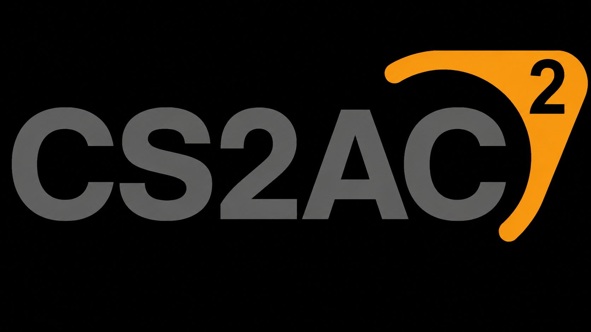

<div align="center">

# CS2AC

### A server-side anti-cheat for Counter-Strike 2

[](https://github.com/karola3vax/CS2AC/actions/workflows/build.yml) [](https://github.com/karola3vax/CS2AC) [](#what-it-detects) [](LICENSE)



<!-- Add docs/detection.gif here when the original CS2AC chat and center-screen demonstration is ready.

-->

</div>

CS2AC catches common CS2 cheats and exploits from the server side. It watches aim, movement, shots, player settings, and inputs, then announces confirmed detections in chat and on screen. It can also send a Discord report and run your own ban or kick command.

- **No client download:** everything runs on the game server.
- **Ready out of the box:** all detectors are enabled by default.
- **Works with your admin plugin:** CS2AC sends the ban or kick command you choose.
- **Easy to follow:** detections appear in chat, on screen, in the server console, and optionally in Discord.
- **Safe whitelist:** whitelisted players can still be detected, but they are never punished.

## What it detects

All 17 detectors are enabled by default.

| Aim cheats | Movement cheats | Exploits and other cheats |
| --- | --- | --- |
| **Aimbot** - blatant snap-to-target shots | **Autostrafe** - scripted air strafing | **DLL Injection** - unusual game-event listeners used by injected cheats |
| **Aimlock** - tracking an enemy too perfectly for too long | **Bhop** - repeated frame-perfect bunny hops | **Desubticking** - removing the normal timing from subtick inputs |
| **Silentaim** - shots landing far away from the player's visible aim | **Hyperscroll** - jump inputs faster than normal scrolling | **Doubletap** - firing twice faster than the weapon allows |
| **Inhuman Accuracy** - keeping unrealistically high accuracy over many shots | **Nulls** - perfectly timed left/right movement normally produced by scripts | **Invalid CVar** - forbidden or impossible client settings |
| **Irregular Behavior** - too many unlikely airborne or no-scope results |  | **Invalid Input** - broken or impossible player commands |
|  |  | **Antiaim** - impossible pitch, roll, spinning, or jittering view angles |
|  |  | **Namechanger** - rapidly spamming name changes |
|  |  | **Subtick Spam** - packing too many inputs into one command |

## What a detection looks like

```text
[CS2AC] detected AIMBOT on Player and punished.
```

Everyone sees the detection in chat and through a five-second center-screen alert. The same result is written to the server console, so the server owner is never left guessing what happened.

<!-- Add docs/announcements.gif here when the original CS2AC announcement demonstration is ready.

-->

Discord reports show who was detected, what CS2AC found, what punishment was sent, and where it happened. They also include the player's SteamID64 and Steam avatar when available.

<!-- Add docs/webhook.gif here when the original CS2AC Discord report demonstration is ready.

-->

## FAQ

<details>
<summary><strong>Do players need to install anything?</strong></summary>

No. Players join like normal. CS2AC runs only on your dedicated server.

</details>

<details>
<summary><strong>Does it work in Premier or Valve matchmaking?</strong></summary>

No. You need control of a community or dedicated server running Metamod:Source.

</details>

<details>
<summary><strong>Does it work with CS2-SimpleAdmin or another admin plugin?</strong></summary>

Yes. The default commands are made for CS2-SimpleAdmin. If you use something else, replace them with that plugin's ban and kick commands in `cs2ac.cfg`.

</details>

<details>
<summary><strong>Which detections ban and which only kick?</strong></summary>

Desubticking, Nulls, and Subtick Spam kick by default. The other detections permanently ban by default. You can change or disable either command without turning off detection messages.

</details>

<details>
<summary><strong>What happens to whitelisted players?</strong></summary>

They are still detected and shown in chat, on screen, and in Discord, but CS2AC does not send a ban or kick command.

</details>

<details>
<summary><strong>Can CS2AC catch every cheat?</strong></summary>

No. A server-side plugin cannot see everything running on a player's PC. CS2AC catches the cheating behavior that reaches the server and waits for enough evidence before acting.

</details>

## Installation

1. Install [Metamod:Source](https://www.sourcemm.net/) 2.x on a Windows x64 or Linux x64 CS2 dedicated server.
2. Download the matching CS2AC package from [GitHub Releases](https://github.com/karola3vax/CS2AC/releases).
3. Extract the archive into the CS2 server root without rearranging it. The archive begins with the `game` folder.
4. Edit `game/csgo/cfg/cs2ac.cfg`.
5. Start the server and run `meta list`, then `cs2ac_status`.

CS2AC loads `cs2ac.cfg` when the plugin starts and again on every map change.

## Configuration

The included [`cs2ac.cfg`](cfg/cs2ac.cfg) explains every option. These are the main ones:

| Setting | Default | Meaning |
| --- | --- | --- |
| `cs2ac_enabled` | `1` | Turn CS2AC on or off. |
| `cs2ac_whitelist` | empty | SteamID64s that CS2AC must never punish. |
| `cs2ac_*_enabled` | `1` | Turn a specific detector on or off. |
| `cs2ac_chat_announcements` | `1` | Announce detections in public chat. |
| `cs2ac_center_announcements` | `1` | Show detections at the center of the screen. |
| `cs2ac_punishment_command` | `css_addban ...` | Command used for permanent bans. |
| `cs2ac_kick_command` | `css_kick ...` | Command used for kicks. |
| `cs2ac_webhook_url` | empty | Discord webhook that receives detection reports. |
| `cs2ac_webhook_role_id` | empty | Discord role to mention when someone is detected. |
| `cs2ac_webhook_server_address` | automatic | Server address shown in Discord reports. |
| `cs2ac_webhook_logo_url` | empty | Logo and fallback player image used in Discord. |
| `cs2ac_allow_sv_cheats_testing` | `0` | Let you test detectors locally with `sv_cheats 1`. Keep this off on a public server. |

Punishment commands support `{steamid64}`, `{userid}`, and `{detection}`:

```cfg
cs2ac_punishment_command "css_addban {steamid64} 0 CS2AC: {detection}"
cs2ac_kick_command "css_kick #{userid} CS2AC: {detection}"
```

Whitelist one or more Steam accounts with:

```cfg
cs2ac_whitelist "76561198000000001,76561198000000002"
```

## Discord reports

1. Create a Discord webhook for the channel that should receive detections.
2. Put its URL in `cs2ac_webhook_url`.
3. Run `cs2ac_reload`.
4. Run `cs2ac_webhook_test`.

Keep the webhook URL private. If Discord returns an error, CS2AC pauses webhook reports until you fix the setting and run `cs2ac_reload`.

## Administrator commands

| Command | What it does |
| --- | --- |
| `cs2ac_status` | Show whether CS2AC and its main features are working. |
| `cs2ac_help` | List these commands in the server console. |
| `cs2ac_reload` | Reload `cs2ac.cfg`. |
| `cs2ac_check_config` | Check the config for mistakes. |
| `cs2ac_test_announcement` | Test the chat and center-screen message without detecting anyone. |
| `cs2ac_webhook_test` | Send a test report to Discord. |

## Good to know

- CS2AC cannot scan a player's PC, memory, or files. DLL Injection looks for suspicious game-event listeners exposed to the server.
- You need an admin plugin such as CS2-SimpleAdmin for the default ban and kick commands to work.
- CS2AC ignores incomplete evidence instead of guessing. That lowers false bans, but it also means no anti-cheat can promise to catch everyone.
- Valve updates can break server plugins. Keep CS2AC and Metamod:Source updated, then run `cs2ac_status` after a game update.
- Debug messages are off by default and should only be enabled while troubleshooting.

## Building

Clone the pinned submodules with the project:

```sh
git clone --recursive https://github.com/karola3vax/CS2AC.git
cd CS2AC
```

Windows needs Python 3.8 or newer and Visual Studio 2022 with the C++ workload:

```powershell
./build-windows.ps1
```

Linux needs Python 3.8 or newer and Docker:

```sh
./build-linux.sh
```

Both scripts fetch the pinned AMBuild revision. Linux compilation runs inside the pinned Steam Runtime 3 SDK image. Directly installable files are placed under the build folder's `package/game` directory.

Pushes and pull requests build Windows and Linux in GitHub Actions. Pushing a signed or annotated `v*` tag creates a GitHub release with both packages.

## License

CS2AC is licensed under the [GNU Affero General Public License v3.0](LICENSE). Pinned SDK, build, and vendored dependencies keep their own licenses; see [Third-party notices](THIRD_PARTY_NOTICES.md). Binary packages include the applicable license texts.
