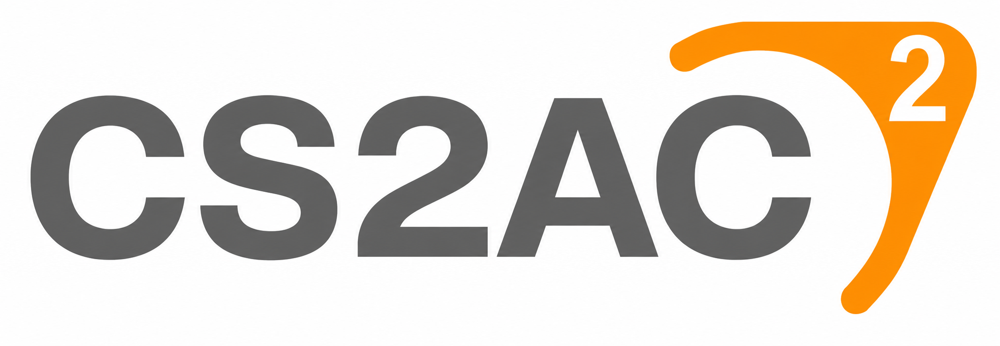
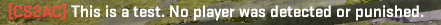
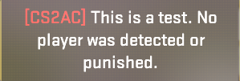
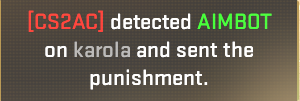
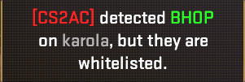
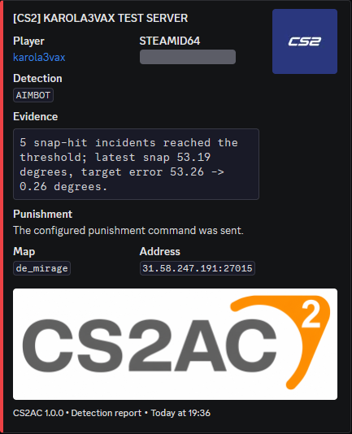

<div align="center">



### Open-source server-side anti-cheat for Counter-Strike 2.

[](https://github.com/karola3vax/CS2AC/actions/workflows/build.yml)
[](https://github.com/karola3vax/CS2AC)
[](#17-detections-one-plugin)
[](#quickstart)
[](LICENSE)

**Counter-Strike is at its best when every shot, clutch, and win is earned.**

CS2AC helps community servers keep it that way.

[Download](https://github.com/karola3vax/CS2AC/releases) · [Install](#quickstart) · [See every detection](#17-detections-one-plugin) · [Pair it with CS2FOW](#want-wallhack-protection-too)

</div>

<table>
<tr>
<td width="50%"><strong>Catches more than spinbots</strong><br>Snap aim, smooth aimlock, silent aim, anti-aim, bhop scripts, rapid fire, and more.</td>
<td width="50%"><strong>Nothing to install</strong><br>No client or kernel driver. Join the server and play like normal.</td>
</tr>
<tr>
<td width="50%"><strong>The whole server sees it</strong><br>When someone is caught, the detection appears in chat and at the center of the screen.</td>
<td width="50%"><strong>Evidence before punishment</strong><br>Every detection comes from a specific cheating pattern, not a guess based on K/D.</td>
</tr>
</table>

## See it catch

Real in-game clips. No mockups.

<table>
<tr>
<td width="50%" align="center">

<br><strong>AIMBOT</strong><br>
<sub>A blatant snap lands on target. CS2AC keeps the evidence.</sub>
</td>
<td width="50%" align="center">

<br><strong>AIMLOCK</strong><br>
<sub>The crosshair follows a moving target with inhuman precision.</sub>
</td>
</tr>
<tr>
<td width="50%" align="center">

<br><strong>ANTIAIM</strong><br>
<sub>Impossible angles, attack-return, jitter, and spin patterns.</sub>
</td>
<td width="50%" align="center">

<br><strong>BHOP</strong><br>
<sub>Repeated frame-perfect hops and machine-like jump patterns.</sub>
</td>
</tr>
<tr>
<td width="50%" align="center">

<br><strong>IRREGULAR BEHAVIOR</strong><br>
<sub>Too many rage-level airborne and no-scope results.</sub>
</td>
<td width="50%" align="center">

<br><strong>SILENTAIM</strong><br>
<sub>The bullets hit somewhere the visible aim never pointed.</sub>
</td>
</tr>
</table>

## 17 detections. One plugin.

### Aim and accuracy

<table>
<tr>
<td width="22%"><strong>Aimbot</strong></td>
<td><strong>Cheat:</strong> Snaps the crosshair onto an enemy just before shooting.<br><strong>CS2AC:</strong> Looks for the same sharp snap leading straight to damaging hits again and again.</td>
</tr>
<tr>
<td><strong>Aimlock</strong></td>
<td><strong>Cheat:</strong> Smoothly follows a moving enemy with almost no shake or error.<br><strong>CS2AC:</strong> Watches for aim that stays unnaturally glued to a target for too long, even through walls.</td>
</tr>
<tr>
<td><strong>Silentaim</strong></td>
<td><strong>Cheat:</strong> Lands a shot somewhere the player's crosshair never appeared to point.<br><strong>CS2AC:</strong> Compares where the player aimed, where the bullet landed, and whether that bullet dealt damage.</td>
</tr>
<tr>
<td><strong>Inhuman Accuracy</strong></td>
<td><strong>Cheat:</strong> Removes the misses that even great players still make.<br><strong>CS2AC:</strong> Watches a longer run of aimed shots and catches accuracy that normal play cannot keep up.</td>
</tr>
<tr>
<td><strong>Irregular Behavior</strong></td>
<td><strong>Cheat:</strong> Makes airborne and no-scope kills far more reliable than they should be.<br><strong>CS2AC:</strong> Counts both the attempts and the results, so one lucky shot means nothing.</td>
</tr>
</table>

### Movement

<table>
<tr>
<td width="22%"><strong>Autostrafe</strong></td>
<td><strong>Cheat:</strong> Steers through the air automatically to keep speed and make every strafe count.<br><strong>CS2AC:</strong> Looks for jump after jump with movement that is too fast, efficient, and perfectly timed.</td>
</tr>
<tr>
<td><strong>Bhop</strong></td>
<td><strong>Cheat:</strong> Jumps at the exact moment the player touches the ground.<br><strong>CS2AC:</strong> Waits for a long chain of frame-perfect hops or the same landing pattern repeating over and over.</td>
</tr>
<tr>
<td><strong>Hyperscroll</strong></td>
<td><strong>Cheat:</strong> Floods the game with far more jump presses than normal mouse-wheel scrolling.<br><strong>CS2AC:</strong> Looks for excessive scrolling that also keeps producing frame-perfect hops.</td>
</tr>
<tr>
<td><strong>Nulls</strong></td>
<td><strong>Cheat:</strong> Switches opposite movement keys at the perfect moment while the player is airborne.<br><strong>CS2AC:</strong> Waits for a long chain of direction changes with timing that is simply too perfect.</td>
</tr>
</table>

### Exploits and client behavior

<table>
<tr>
<td width="22%"><strong>Antiaim</strong></td>
<td><strong>Cheat:</strong> Sends fake angles, making the player spin, jitter, or look in impossible directions.<br><strong>CS2AC:</strong> Watches for impossible views and aim that jumps away for a shot before snapping straight back.</td>
</tr>
<tr>
<td><strong>DLL Injection</strong></td>
<td><strong>Cheat:</strong> Listens to hidden game events to power some of its features.<br><strong>CS2AC:</strong> Checks what events the player's game is listening to and finds ones linked to injected cheats.</td>
</tr>
<tr>
<td><strong>Desubticking</strong></td>
<td><strong>Cheat:</strong> Removes the normal timing from movement to make automated inputs behave differently.<br><strong>CS2AC:</strong> Looks for movement that keeps arriving at the exact same instant instead of naturally between ticks.</td>
</tr>
<tr>
<td><strong>Doubletap</strong></td>
<td><strong>Cheat:</strong> Makes the same weapon fire twice before it should be ready.<br><strong>CS2AC:</strong> Compares the two shots with that weapon's real firing speed.</td>
</tr>
<tr>
<td><strong>Invalid CVar</strong></td>
<td><strong>Cheat:</strong> Changes protected game settings to values normal players should never have.<br><strong>CS2AC:</strong> Checks those settings directly and notices when the player's game reports an impossible value.</td>
</tr>
<tr>
<td><strong>Invalid Input</strong></td>
<td><strong>Cheat:</strong> Changes movement buttons without leaving the normal record of those presses.<br><strong>CS2AC:</strong> Checks whether the player's button presses tell the same story as their movement.</td>
</tr>
<tr>
<td><strong>Namechanger</strong></td>
<td><strong>Cheat:</strong> Rapidly changes the player's name to distract people or show off.<br><strong>CS2AC:</strong> Notices when the same player changes name five times within one minute.</td>
</tr>
<tr>
<td><strong>Subtick Spam</strong></td>
<td><strong>Cheat:</strong> Packs too many movement and aim changes into the same instant.<br><strong>CS2AC:</strong> Waits for those unnatural bursts to repeat within a very short time.</td>
</tr>
</table>

## One detection. Everywhere.

When CS2AC acts, it can do all of this at once:

1. Announce the detection in public chat.
2. Hold a clear center-screen alert for five seconds.
3. Write the evidence and punishment result to the server console.
4. Run your configured ban or kick command.
5. Send a detailed Discord webhook report.

```text
[CS2AC] detected AIMBOT on Player and punished.
```

<div align="center">



<table>
<tr>
<td width="33%" align="center">

<br><strong>Five-second center alert</strong>
</td>
<td width="33%" align="center">

<br><strong>Detection sent</strong>
</td>
<td width="33%" align="center">

<br><strong>Whitelist stays visible</strong>
</td>
</tr>
</table>

</div>

Whitelisting does not silence CS2AC. The detection still appears in chat, on screen, in the console, and in Discord; only the punishment command is skipped.

## Quickstart

You need a Windows x64 or Linux x64 CS2 dedicated server running [Metamod:Source](https://www.sourcemm.net/) 2.x.

1. Download the matching package from [GitHub Releases](https://github.com/karola3vax/CS2AC/releases).
2. Extract it into the CS2 server root without rearranging anything. The package begins with the `game` folder.
3. Edit `game/csgo/cfg/cs2ac.cfg`.
4. Start the server.
5. Run `meta list`, then `cs2ac_status`.

That is it. Players install nothing.

The default punishment commands are made for [CS2-SimpleAdmin](https://github.com/daffyyyy/CS2-SimpleAdmin). Using another admin plugin? Replace the two commands in `cs2ac.cfg` with commands that plugin understands.

## Configuration that makes sense

The included [`cs2ac.cfg`](cfg/cs2ac.cfg) explains every option in plain language.

| Setting | Default | What it does |
| --- | ---: | --- |
| `cs2ac_enabled` | `1` | Master switch for CS2AC. |
| `cs2ac_whitelist` | empty | SteamID64s that may be detected but must never be punished. |
| `cs2ac_*_enabled` | `1` | Enable or disable one detection module. |
| `cs2ac_chat_announcements` | `1` | Show detections in public chat. |
| `cs2ac_center_announcements` | `1` | Show the five-second center alert. |
| `cs2ac_punishment_command` | `css_addban ...` | Command used for permanent bans. |
| `cs2ac_kick_command` | `css_kick ...` | Command used for kick-only detections. |
| `cs2ac_webhook_url` | empty | Discord webhook that receives detection reports. |
| `cs2ac_webhook_role_id` | empty | Discord role to mention on a report. |
| `cs2ac_webhook_server_address` | automatic | Server address shown in Discord. |
| `cs2ac_allow_sv_cheats_testing` | `0` | Allow local detector testing with `sv_cheats 1`. Never enable this on a public server. |

Punishment commands support `{steamid64}`, `{userid}`, and `{detection}`:

```cfg
cs2ac_punishment_command "css_addban {steamid64} 0 CS2AC: {detection}"
cs2ac_kick_command "css_kick #{userid} CS2AC: {detection}"
```

Whitelist one account or a comma-separated list:

```cfg
cs2ac_whitelist "76561198000000001,76561198000000002"
```

### Discord in four steps

1. Create a webhook in the Discord channel that should receive detections.
2. Put its URL in `cs2ac_webhook_url`.
3. Run `cs2ac_reload`.
4. Run `cs2ac_webhook_test`.

Keep the webhook URL private. CS2AC never prints it back to the console.

<div align="center">

</div>

<details>
<summary><strong>Server commands</strong></summary>

| Command | What it does |
| --- | --- |
| `cs2ac_status` | Show whether CS2AC and its main features are working. |
| `cs2ac_help` | List the available CS2AC commands. |
| `cs2ac_reload` | Reload `cs2ac.cfg`. |
| `cs2ac_check_config` | Find mistakes in the current configuration. |
| `cs2ac_test_announcement` | Preview the chat and center-screen alert without detecting anyone. |
| `cs2ac_webhook_test` | Send a test detection report to Discord. |

</details>

## Straight answers

<details>
<summary><strong>Do players install anything?</strong></summary>

No. CS2AC runs inside the dedicated server. Players connect and play normally.

</details>

<details>
<summary><strong>Does it work in Premier or Valve matchmaking?</strong></summary>

No. You need control of a community or dedicated server running Metamod:Source.

</details>

<details>
<summary><strong>Can it catch every cheat?</strong></summary>

No anti-cheat can promise that. CS2AC sees the cheating behavior that reaches the server; it cannot inspect a player's files, memory, or desktop.

That also means **DLL Injection does not scan anyone's PC**. It looks for suspicious game-event subscriptions that the client exposes to the server.

</details>

<details>
<summary><strong>Which detections ban and which only kick?</strong></summary>

Desubticking, Nulls, and Subtick Spam use the kick command by default. Every other detection uses the permanent-ban command by default.

You can replace or empty either command without disabling detection announcements.

</details>

<details>
<summary><strong>What happens to whitelisted players?</strong></summary>

They are still detected and shown everywhere, but CS2AC never sends a punishment command for them.

</details>

<details>
<summary><strong>Does it support FFA?</strong></summary>

Yes. CS2AC follows `mp_teammates_are_enemies`, so other players are treated as enemies when FFA is enabled.

</details>

<details>
<summary><strong>Does CS2AC advertise itself?</strong></summary>

Every six completed rounds, CS2AC shows one chat and center-screen credit:

```text
[CS2AC] This server is protected by karola3vax's anti-cheat.
```

This project credit is built in and has no disable option.

</details>

## Want wallhack protection too?

**CS2AC catches cheating behavior. [CS2FOW](https://github.com/karola3vax/CS2FOW) stops your server from sending live enemy positions through solid walls and smoke.**

They solve different problems, run entirely on the server, and can protect the same CS2 community server together.

## Building from source

Clone the pinned submodules:

```sh
git clone --recursive https://github.com/karola3vax/CS2AC.git
cd CS2AC
```

Windows needs Python 3.8 or newer and Visual Studio 2022 with the C++ workload:

```powershell
./build-windows.ps1
```

Linux needs Python 3.8 or newer and Docker:

```sh
./build-linux.sh
```

Both scripts make a directly installable package under the build folder's `package/game` directory. Linux builds inside the pinned Steam Runtime 3 SDK image.

## Be part of it

Run CS2AC on a real server. Test it. Break it. Send useful reports.

If it earns a place on your server, **star the repository and share your clips**. That is how an open-source anti-cheat gets harder to bypass.

## License

CS2AC is free and open-source software licensed under the [GNU Affero General Public License v3.0](LICENSE). Dependencies keep their own licenses; see [Third-party notices](THIRD_PARTY_NOTICES.md).
